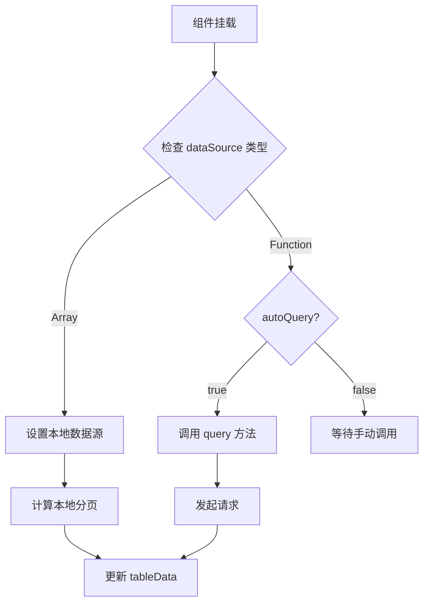
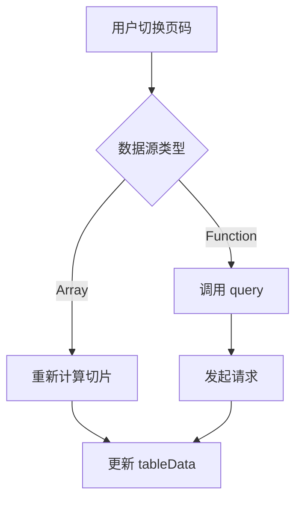

# 表格组件设计文档

## 架构概述

表格组件采用"组件 + Composable"的架构模式:

```
c-table (组件层)
  ├── index.vue          # 主组件,负责渲染和用户交互
  ├── table-column.vue   # 列组件,支持嵌套
  └── useTable.js        # Composable,负责数据管理和业务逻辑
```

### 职责划分

- **index.vue**: UI 渲染、事件处理、props 接收、方法暴露
- **table-column.vue**: 递归渲染列配置、插槽传递
- **useTable.js**: 数据状态管理、分页逻辑、数据请求

## 核心设计

### 1. 数据源设计

支持两种数据源类型:

#### 数组数据源(本地分页)

```javascript
const dataSource = [
  { id: 1, name: '张三', age: 25 },
  { id: 2, name: '李四', age: 30 }
]
```

**行为**:

- 组件内部实现分页逻辑
- 切换页码时从完整数据中切片
- 不触发网络请求

#### Promise 数据源(远程分页)

```javascript
const dataSource = (params) => {
  return api.getUsers({
    page: params.current,
    pageSize: params.pageSize
  })
}
```

**行为**:

- 自动调用函数获取数据
- 传入当前分页参数
- 自动管理 loading 状态
- 切换页码时重新请求

### 2. 分页设计

#### 分页状态

```javascript
{
  current: 1,      // 当前页码
  pageSize: 10,    // 每页条数
  total: 100       // 总条数
}
```

#### 分页模式

1. **本地分页** (`useLocalPagination: true` 或数组数据源)
   - 前端计算分页
   - `total` 为数组长度
   - 切换页码时切片数据

2. **远程分页** (Promise 数据源)
   - 后端返回分页数据
   - `total` 从响应中提取
   - 切换页码时请求新数据

### 3. 数据格式化

支持两种响应格式:

#### 标准格式 (`isNewTable: true`)

```javascript
{
  data: {
    list: [...],      // 数据列表
    total: 100,       // 总条数
    pageNum: 1        // 当前页码
  }
}
```

#### 旧格式 (默认)

```javascript
{
  data: [...],        // 直接是数据数组
  totalCount: 100     // 总条数
}
```

#### 自定义格式 (`formatFunc`)

```javascript
const formatFunc = (response) => ({
  list: response.items,
  total: response.count,
  current: response.page
})
```

### 4. 列配置设计

#### 基础列配置

```javascript
{
  prop: 'name',           // 字段名
  label: '姓名',          // 列标题
  width: '120',           // 列宽
  align: 'center',        // 对齐方式
  fixed: 'left',          // 固定列
  sortable: true,         // 可排序
  showOverflowTooltip: true  // 溢出提示
}
```

#### 嵌套列配置

```javascript
{
  label: '用户信息',
  children: [
    { prop: 'name', label: '姓名' },
    { prop: 'age', label: '年龄' }
  ]
}
```

#### 自定义列内容(插槽)

使用与列 `prop` 同名的插槽自定义列内容:

```vue
<c-table :columns="columns">
  <template #status="{ row, column, index }">
    <el-tag>{{ row.status }}</el-tag>
  </template>
</c-table>
```

**插槽参数**:

- `row`: 当前行数据
- `column`: 列配置对象
- `index`: 行索引

#### 自定义表头(插槽)

使用 `prop + 'Header'` 命名的插槽自定义表头:

```vue
<c-table :columns="columns">
  <!-- 自定义 status 列的表头 -->
  <template #statusHeader>
    <el-icon><InfoFilled /></el-icon>
    <span>状态信息</span>
  </template>
  
  <!-- 自定义 status 列的内容 -->
  <template #status="{ row }">
    <el-tag>{{ row.status }}</el-tag>
  </template>
</c-table>
```

**命名规则**:

- 列内容插槽: `#${prop}`
- 表头插槽: `#${prop}Header`

**示例**:

```javascript
// 列配置
{ prop: 'userName', label: '用户名' }

// 对应插槽
<template #userName="{ row }">...</template>      // 列内容
<template #userNameHeader>...</template>          // 表头
```

### 5. API 设计

#### Props

| 名称 | 类型 | 默认值 | 说明 |
|------|------|--------|------|
| columns | Array | - | 列配置 |
| dataSource | Array\|Function | - | 数据源 |
| pagination | Object\|Boolean | true | 分页配置 |
| checkable | Boolean | false | 是否多选 |
| indexable | Boolean | false | 是否显示序号 |
| autoQuery | Boolean | true | 是否自动查询 |
| isNewTable | Boolean | false | 使用新数据格式 |
| useLocalPagination | Boolean | false | 强制本地分页 |
| formatFunc | Function | - | 数据格式化函数 |
| defaultParams | Object | {} | 默认查询参数 |

#### Events

| 名称 | 参数 | 说明 |
|------|------|------|
| sizeChange | pageSize | 每页条数变化 |
| currentChange | current | 页码变化 |
| selection-change | selection | 多选变化 |

#### Methods

| 名称 | 参数 | 返回值 | 说明 |
|------|------|--------|------|
| query | params | - | 查询数据 |
| getSelection | - | Array | 获取选中行 |
| changeCurrentPage | page | - | 切换页码 |
| getState | - | Object | 获取状态 |
| clearSort | - | - | 清除排序 |

## 数据流

### 初始化流程



### 分页切换流程



## 状态管理

### useTable 返回值

```javascript
{
  // 状态
  loading: Ref<boolean>,
  tableData: Ref<Array>,
  current: Ref<number>,
  pageSize: Ref<number>,
  total: Ref<number>,
  
  // 方法
  query: (params?) => Promise<void>,
  handleSizeChange: (size) => void,
  handleCurrentChange: (page) => void,
  handleSelectionChange: (selection) => void,
  setLocalDatasource: (data) => void,
  getSelection: () => Array,
  changeCurrentPage: (page) => void,
  getState: () => Object
}
```

## 错误处理

### 请求失败

```javascript
try {
  const response = await dataSource(params)
  // 处理数据
} catch (error) {
  console.error('表格数据请求失败:', error)
  loading.value = false
  tableData.value = []
}
```

### 数据格式错误

```javascript
// 提供默认值避免崩溃
const { data = {}, totalCount = 0 } = response || {}
const { list = [], total = 0 } = data || {}
```

## 性能优化

1. **避免重复请求**
   - 使用 `autoQuery` 控制自动查询
   - 防抖处理快速切换

2. **本地分页优化**
   - 只切片当前页数据
   - 避免全量渲染

3. **响应式优化**
   - 使用 `shallowRef` 存储大数组
   - 避免深度监听

## 兼容性考虑

### 向后兼容

- 支持旧数据格式 (`totalCount`)
- 支持 `isNewTable` 标志切换格式
- 保留所有现有 props

### 渐进增强

- 默认行为保持简单
- 高级功能通过 props 开启
- 提供合理的默认值

## 风险评估

| 风险 | 影响 | 缓解措施 |
|------|------|----------|
| 数据格式不一致 | 高 | 提供 formatFunc 自定义 |
| 请求失败 | 中 | 完善错误处理和提示 |
| 性能问题 | 低 | 本地分页 + 虚拟滚动(未来) |
| API 变更 | 低 | 保持向后兼容 |

## 未来扩展

1. **虚拟滚动**: 支持大数据量渲染
2. **表格编辑**: 行内编辑功能
3. **导出功能**: Excel/CSV 导出
4. **列配置持久化**: 保存用户的列设置
5. **高级筛选**: 列筛选、多条件筛选
